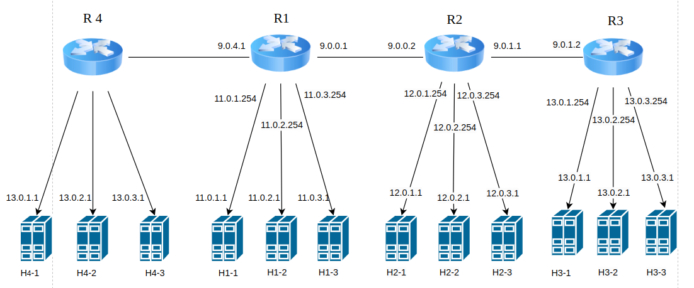

## Clone

       git clone https://github.com/yuvrajmakkena/Mininet-BGP/tree/main

## Folder structure

## Topology

   

## Simulate the Network
     
       sudo python bgp.py

## Flow

- Setup: AS1, AS2, and AS3 are legitimate Autonomous Systems interconnected with routing daemons. AS1 has a BGP route to reach a specific IP prefix (e.g., 13.0.0.0/8) through AS2 and AS3.
- Initially, these hosts in AS1 were communicating with a web server in AS3 using the legitimate BGP route through AS2 and AS3.
- When AS4 (rogue AS) starts advertising a BGP route to the same IP prefix (e.g., 13.0.0.0/8) with a shorter attractive path, AS1 updates its routing tables to prefer the new, shorter route via AS4.
- As a result, traffic from hosts h1-1, h1-2, and h1-3 is redirected through AS4 instead of the legitimate path through AS2 and AS3.
- This redirection may allow AS4 to inspect, manipulate, or block the traffic as it passes through.

Affected Hosts in AS1:
- Hosts h1-1, h1-2, and h1-3 in AS1 are the ones compromised and attacked by the BGP hijacking attack.

## Network IPs

### AS1

| Host | Interface | IP       |
|------|-----------|----------|
| R1   | R1-eth1   | 11.0.1.254 |
| R1   | R1-eth2   | 11.0.2.254 |
| R1   | R1-eth3   | 11.0.3.254 |
| R1   | R1-eth4   | 9.0.0.1   |
| R1   | R1-eth5   | 9.0.4.1   |
| h1-1 | eth0      | 11.0.1.1  |
| h1-2 | eth0      | 11.0.2.1  |
| h1-3 | eth0      | 11.0.3.1  |

### AS2

| Host | Interface    | IP        |
|------|--------------|-----------|
| R2   | R2-eth1      | 12.0.1.254 |
| R2   | R2-eth2      | 12.0.2.254 |
| R2   | R2-eth3      | 12.0.3.254 |
| R2   | R2-eth4      | 9.0.0.2   |
| R2   | R2-eth5      | 9.0.1.1   |
| h2-1 | h2-1-eth0    | 12.0.1.1  |
| h2-2 | h2-2-eth0    | 12.0.2.1  |
| h2-3 | h2-3-eth0    | 12.0.3.1  |

### AS3

| Host | Interface   | IP        |
|------|------------|-----------|
| R3   | R3-eth1    | 13.0.1.254|
| R3   | R3-eth2    | 13.0.2.254|
| R3   | R3-eth3    | 13.0.3.254|
| R3   | R3-eth4    | 9.0.1.2   |
| h3-1 | h3-1-eth0  | 13.0.1.1  |
| h3-2 | h3-2-eth0  | 13.0.2.1  |
| h3-3 | h3-3-eth0  | 13.0.3.1  |

### AS4

| Host | Interface  | IP       |
|------|------------|----------|
| h4-1 | h4-1-eth0  | 13.0.1.1 |
| h4-2 | h4-2-eth0  | 13.0.2.1 |
| h4-3 | h4-3-eth0  | 13.0.3.1 |

## Start a Host Console 

       xterm <host> (host = h1-1,h2-2,R1 e.t.c)
 
## Get BGP Table
     
       sh ip bgp

## Start Rouge AS

     
       ./start_rogue.sh

## To Stop Rogue AS

       ./stop_rogue.sh

## Get Forwarding/Routing Table
     
       sh ip bgp

## To Open Wireshark
     
       sudo wireshark &

      

      

   
       
 
